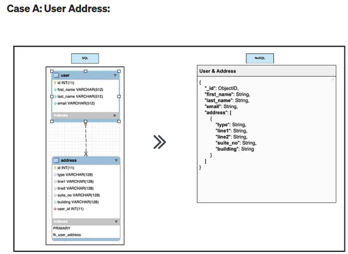

### What is Cloud Computing?

**Cloud computing** is the delivery of computing services over the internet ("the cloud"). These services include:

- **Storage**: Saving and retrieving data.
- **Processing**: Running applications and performing computations.
- **Networking**: Connecting different systems and applications.

Instead of owning physical hardware and software, users can rent computing resources from cloud providers (like Amazon Web Services, Google Cloud, Microsoft Azure) and access them online.

**Example**: When you use Google Drive to store files, you're using cloud storage. You don't need to buy a physical hard drive; Google provides the storage space and manages it for you.

`` 
mycomment : cloud computing is  stroe, process, network over the internet instead of buy many computers. 
``
### How Do We Know if Something is in the Cloud?

Something is in the cloud if it can be accessed and used over the internet without being stored locally on your device. 

**Indicators**:
1. **Internet Access**: You need an internet connection to access it.
2. **No Local Storage**: The data or application isn't stored on your personal device but on remote servers.
3. **URL Access**: Often accessed through a web browser or specific apps.

**Example**: 
- Using Gmail for email instead of Outlook installed on your computer.
- Streaming movies on Netflix instead of watching them from a DVD.

``
mycomment : first, you need internet. 
if you find files or any documents that you uploaded is found in cloud but not stored in your local machine,
We can consider as they are in cloud.
``

### Differences Between On-Prem and the Cloud

**On-Prem (On-Premises)**:
- **Location**: Servers and infrastructure are located on the company’s physical site.
- **Control**: Full control over hardware and software configurations.
- **Cost**: Higher upfront cost for purchasing and maintaining hardware.
- **Scalability**: Limited by the physical hardware; scaling up requires buying more equipment.
- **Maintenance**: Company’s IT team is responsible for managing and maintaining everything.

**Cloud**:
- **Location**: Servers and infrastructure are located in remote data centers managed by cloud providers.
- **Control**: Less direct control over hardware but easier management through provider tools.
- **Cost**: Pay-as-you-go model; you pay for what you use, which can be more cost-effective.
- **Scalability**: Easily scalable; you can quickly add or remove resources based on need.
- **Maintenance**: Cloud provider handles hardware maintenance and updates.

**Example**:
- **On-Prem**: A company runs its own email server in its office.
- **Cloud**: The same company uses Microsoft Office 365 for email, which is hosted by Microsoft in the cloud.

By understanding these basic concepts, you can better grasp how modern computing works and why businesses might choose one option over the other. 


### 4 Deployment Models of Cloud Computing

1. **Private Cloud**:
   - **Definition**: A cloud environment operated exclusively for a single organization.
   - **How It Works**: Managed either internally or by a third party, with resources dedicated solely to one organization.
   - **Use Case**: Companies with strict security, compliance, or regulatory requirements.
   - **Example**: A large corporation with sensitive data uses a private cloud for better control and security.

2. **Public Cloud**:
   - **Definition**: Cloud services offered over the public internet and available to anyone who wants to purchase them.
   - **How It Works**: Resources are owned and operated by a third-party cloud service provider and shared among multiple customers.
   - **Use Case**: Startups and businesses looking for cost-effective, scalable solutions without managing physical infrastructure.
   - **Example**: Amazon Web Services (AWS), Microsoft Azure, and Google Cloud Platform (GCP).

3. **Hybrid Cloud**:
   - **Definition**: A combination of private and public clouds, allowing data and applications to be shared between them.
   - **How It Works**: Enables data and applications to move between private and public clouds, offering greater flexibility and more deployment options.
   - **Use Case**: Businesses that need to balance sensitive data handling with cost-effective, scalable public cloud services.
   - **Example**: A company uses a private cloud for sensitive data and a public cloud for less-sensitive applications.

4. **Multi-Cloud**:
   - **Definition**: The use of multiple cloud computing services from different providers.
   - **How It Works**: Organizations use services from various cloud providers to avoid vendor lock-in, enhance performance, or leverage specific services.
   - **Use Case**: Companies aiming for redundancy, resilience, or optimized performance by using best-of-breed services.
   - **Example**: A business uses AWS for data storage, Azure for development, and Google Cloud for machine learning.

### Types of Cloud Services

1. **Infrastructure as a Service (IaaS)**:
   - **Definition**: Provides virtualized computing resources over the internet.
   - **How It Works**: Offers fundamental building blocks like virtual machines, storage, and networking, allowing users to build their own IT environments.
   - **Example**: AWS EC2, Google Compute Engine, Microsoft Azure Virtual Machines.

2. **Platform as a Service (PaaS)**:
   - **Definition**: Provides a platform allowing customers to develop, run, and manage applications without dealing with the underlying infrastructure.
   - **How It Works**: Includes hardware and software tools available over the internet, such as development frameworks, databases, and servers.
   - **Example**: Google App Engine, Microsoft Azure App Service, Heroku.

3. **Software as a Service (SaaS)**:
   - **Definition**: Delivers software applications over the internet, on a subscription basis.
   - **How It Works**: Users access applications via a web browser; the provider manages the infrastructure, platforms, and software.
   - **Example**: Google Workspace (formerly G Suite), Microsoft Office 365, Salesforce.

### Summary of Differences

- **Deployment Models**:
  - **Private Cloud**: Exclusive to one organization, high control, and security.
  - **Public Cloud**: Shared resources, cost-effective, scalable.
  - **Hybrid Cloud**: Mix of private and public, flexible.
  - **Multi-Cloud**: Multiple providers, avoids vendor lock-in, optimized for different needs.

- **Cloud Services**:
  - **IaaS**: Basic infrastructure resources, flexible but requires more management.
  - **PaaS**: Platform for building applications, less management needed.
  - **SaaS**: Ready-to-use applications, minimal management, used directly by end-users.

These models and services allow organizations to choose the best fit for their needs based on factors like control, cost, scalability, and ease of use.

### Advantages and Disadvantages of the Cloud for Businesses

#### Advantages

1. **Cost Savings**:
   - **Reduced Capital Expenditure (CapEx)**: No need to purchase expensive hardware or software upfront.
   - **Operational Expenditure (OpEx)**: Pay for what you use, which can be more cost-effective.

2. **Scalability and Flexibility**:
   - **On-Demand Resources**: Scale resources up or down based on demand without significant delays.
   - **Global Reach**: Easily deploy services and applications in multiple regions worldwide.

3. **Maintenance and Upgrades**:
   - **Automatic Updates**: Cloud providers handle maintenance, updates, and security patches.
   - **Focus on Core Business**: Allows businesses to focus on their core activities instead of IT management.

4. **Accessibility**:
   - **Remote Access**: Employees can access applications and data from anywhere with an internet connection.
   - **Collaboration**: Enhanced collaboration through shared applications and tools.

5. **Disaster Recovery and Backup**:
   - **Built-In Solutions**: Cloud providers offer robust disaster recovery and backup options.

#### Disadvantages

1. **Security Concerns**:
   - **Data Privacy**: Storing sensitive data on third-party servers can raise privacy issues.
   - **Compliance**: Ensuring compliance with industry regulations can be complex.

2. **Downtime**:
   - **Internet Dependency**: Cloud services require a reliable internet connection; outages can impact access.

3. **Cost Management**:
   - **Unpredictable Costs**: Pay-as-you-go can lead to unexpected expenses if usage is not monitored.

4. **Limited Control**:
   - **Vendor Management**: Less direct control over infrastructure and services.

5. **Vendor Lock-In**:
   - **Migration Challenges**: Moving data and applications between providers can be difficult and costly.

### Difference Between  CapEx 자본 지출 and OpEx 운영 지출 

- **Capital Expenditure (CapEx)**:
  - **Definition**: Funds used by a company to acquire, upgrade, and maintain physical assets such as property, industrial buildings, or equipment.
  - **Example**: Buying servers and setting up an on-premises data center.

- **Operational Expenditure (OpEx)**:
  - **Definition**: Ongoing costs for running a business's day-to-day operations.
  - **Example**: Paying for cloud services monthly or annually.

#### Cloud and OpEx vs. CapEx

- **Cloud Services**: Generally fall under OpEx as businesses pay for services based on usage (subscription model).
- **On-Premises**: Requires significant CapEx for infrastructure and ongoing OpEx for maintenance.

### Is Migrating to the Cloud Always Cheaper?

- **Not Always**: While the cloud can reduce CapEx and potentially lower OpEx, migration costs, training, potential downtime during transition, and ongoing costs can add up.
- **Case-by-Case Basis**: Businesses should analyze their specific needs, workloads, and usage patterns to determine cost-effectiveness.

### Market Share Breakdown

Here’s an approximate market share breakdown of the major cloud providers as of recent trends:

1. **Amazon Web Services (AWS)**: 32%
2. **Microsoft Azure**: 23%
3. **Google Cloud Platform (GCP)**: 10%
4. **Others (including IBM Cloud, Oracle Cloud, Alibaba Cloud, etc.)**: 35%

### Diagram: Cloud Market Share

Here’s a simple pie chart representation of the market share:

```plaintext
AWS - 32%
Azure - 23%
GCP - 10%
Others - 35%
```


### The Three Largest Cloud Providers
USPs = Unique Selling Point
1. **Amazon Web Services (AWS)**:
   - **USP**: Largest market share, wide range of services, robust ecosystem.
   - **Popularity**: Known for its scalability, extensive service offerings, and global reach.
   - **Key Services**: EC2 (virtual servers), S3 (storage), RDS (databases).

2. **Microsoft Azure**:
   - **USP**: Strong integration with Microsoft products, hybrid cloud capabilities.
   - **Popularity**: Preferred by enterprises using Microsoft software and services.
   - **Key Services**: Virtual Machines, Azure SQL Database, Azure Active Directory.

3. **Google Cloud Platform (GCP)**:
   - **USP**: Strong in data analytics and machine learning, competitive pricing.
   - **Popularity**: Known for innovations in AI and data processing.
   - **Key Services**: Google Kubernetes Engine (GKE), BigQuery (data warehouse), TensorFlow (machine learning).

These providers are popular due to their unique strengths and comprehensive service offerings, making them suitable for a wide range of business needs.

### Which Cloud Provider Might Be the Best?

Determining the "best" cloud provider depends on specific needs and use cases. Here’s a comparison to help decide:

1. **Amazon Web Services (AWS)**:
   - **Best For**: Wide range of services, scalability, mature ecosystem, global reach.
   - **Why**: AWS has the largest market share and offers an extensive set of tools and services, making it suitable for diverse applications from startups to large enterprises.

2. **Microsoft Azure**:
   - **Best For**: Enterprises using Microsoft products, hybrid cloud deployments.
   - **Why**: Strong integration with Microsoft Office 365, Dynamics, and other Microsoft software. Excellent hybrid cloud capabilities that support on-prem and cloud environments seamlessly.

3. **Google Cloud Platform (GCP)**:
   - **Best For**: Data analytics, machine learning, cost-effective solutions.
   - **Why**: Google’s expertise in data analytics and AI makes GCP a strong choice for businesses focusing on these areas. Competitive pricing and innovative data tools like BigQuery.

### What Do You Usually Need to Pay for When Using the Cloud?

When using cloud services, costs can be categorized based on the type of service and usage:

1. **Compute**:
   - **Virtual Machines**: Pay for the time instances are running.
   - **Serverless Functions**: Pay per execution and compute time.

2. **Storage**:
   - **Object Storage**: Pay per GB stored and data transfer.
   - **Block Storage**: Pay for the size of the allocated storage.

3. **Networking**:
   - **Data Transfer**: Costs for data moving in and out of the cloud.
   - **Content Delivery Network (CDN)**: Charges for distributing content globally.

4. **Databases**:
   - **Managed Databases**: Pay based on storage, compute, and usage metrics.
   - **Backup and Restore**: Costs for backup storage and operations.

5. **Other Services**:
   - **Machine Learning**: Charges for training models and predictions.
   - **Monitoring and Management**: Costs for monitoring services, logging, and managing resources.

### How is Data Used/Managed in the Cloud?

Data in the cloud is managed through various services and practices to ensure accessibility, security, and efficiency:

1. **Storage Solutions**:
   - **Object Storage**: For unstructured data (e.g., AWS S3, Azure Blob Storage, Google Cloud Storage).
   - **Block Storage**: For persistent data storage used by virtual machines (e.g., AWS EBS, Azure Disk Storage).
   - **File Storage**: For shared file systems (e.g., Amazon EFS, Azure Files).

2. **Data Management Practices**:
   - **Data Lifecycle Management**: Policies to automate the movement of data to different storage classes based on usage (hot, cold, archival storage).
   - **Backup and Recovery**: Regular backups and disaster recovery plans to protect data.
   - **Data Encryption**: Encrypting data at rest and in transit to ensure security.
   - **Access Control**: Using Identity and Access Management (IAM) to control who can access data and resources.

3. **Data Processing**:
   - **ETL (Extract, Transform, Load)**: Services to process data for analytics (e.g., AWS Glue, Azure Data Factory, Google Dataflow).
   - **Big Data Analytics**: Tools to handle large-scale data processing (e.g., AWS EMR, Azure Synapse, Google BigQuery).
   - **Real-time Data Processing**: Streaming data services (e.g., AWS Kinesis, Azure Stream Analytics, Google Pub/Sub).

### What Data Professionals Need to Know to Leverage Cloud Technologies Effectively

1. **Cloud Architecture**:
   - **Understanding Cloud Services**: Familiarity with compute, storage, databases, and networking services offered by cloud providers.
   - **Designing Scalable Solutions**: Building architectures that can scale based on demand.

2. **Data Security and Compliance**:
   - **Security Best Practices**: Implementing encryption, access controls, and regular security audits.
   - **Compliance Requirements**: Ensuring data handling complies with relevant regulations (e.g., GDPR, HIPAA).

3. **Data Integration**:
   - **ETL Processes**: Knowledge of tools and techniques to extract, transform, and load data.
   - **APIs and Data Pipelines**: Using APIs and managed services to integrate and process data efficiently.

4. **Analytics and Machine Learning**:
   - **Data Warehousing**: Using cloud-based data warehouses for analytics.
   - **Machine Learning Tools**: Leveraging cloud-native machine learning services for model training and deployment.

5. **Cost Management**:
   - **Monitoring and Optimization**: Using tools to monitor usage and optimize costs (e.g., AWS Cost Explorer, Azure Cost Management, Google Cloud Billing).

### Conclusion

Choosing the best cloud provider depends on specific business needs, existing technology stack, and long-term goals. AWS, Azure, and GCP each have unique strengths that make them suitable for different scenarios. Understanding the cost structure and effectively managing data in the cloud are crucial for maximizing benefits and ensuring security and compliance. Data professionals need to stay updated with the latest cloud technologies and best practices to leverage cloud services effectively.

### 1. **Expedia Group**

#### Background
Expedia Group is a global travel company that operates multiple travel fare aggregators and travel metasearch engines. The company sought to improve its data processing capabilities and deliver personalized customer experiences.

#### Cloud Migration and Use
- **Cloud Provider**: Amazon Web Services (AWS)
- **Solution**: Expedia migrated its data centers to AWS, utilizing services like Amazon S3 for storage, Amazon EMR for big data processing, and Amazon DynamoDB for NoSQL databases.

#### Benefits and Improvements
- **Improved Data Processing**: The cloud migration enabled Expedia to process and analyze massive datasets in real-time, enhancing decision-making.
- **Personalized Customer Experiences**: With advanced analytics, Expedia could offer personalized travel recommendations and improve customer satisfaction.
- **Operational Efficiency**: AWS's managed services reduced the burden of infrastructure management, allowing Expedia to focus on core business activities.

These case studies illustrate how businesses from different industries have leveraged cloud technologies to improve their operations, enhance customer experiences, and achieve cost savings. By migrating to the cloud, these companies have gained agility, scalability, and advanced analytics capabilities.

Certainly! Here are two more case studies of businesses that successfully migrated to the cloud or used cloud technologies to improve their operations:

### 2. **Airbnb**

#### Background
Airbnb, a global online marketplace for lodging and travel experiences, needed a scalable and reliable infrastructure to handle its rapidly growing user base and fluctuating demand.

#### Cloud Migration and Use
- **Cloud Provider**: Amazon Web Services (AWS)
- **Solution**: Airbnb moved its infrastructure to AWS, utilizing services such as Amazon EC2 for scalable compute power, Amazon S3 for storage, and Amazon RDS for managed databases.

#### Benefits and Improvements
- **Scalability**: AWS enabled Airbnb to handle significant traffic spikes during peak travel seasons without performance issues.
- **Reliability**: The robust and reliable infrastructure of AWS ensured high availability and uptime for Airbnb's services.
- **Innovation**: By offloading infrastructure management to AWS, Airbnb's engineers could focus on developing new features and improving the platform, fostering innovation.

### 3. **Domino's Pizza**

#### Background
Domino's Pizza, a leading global pizza delivery company, aimed to modernize its IT infrastructure to improve customer experiences, streamline operations, and support its digital transformation initiatives.

#### Cloud Migration and Use
- **Cloud Provider**: Microsoft Azure
- **Solution**: Domino's migrated its data centers to Microsoft Azure, leveraging Azure's cloud services for application hosting, data storage, and analytics. They used Azure Functions for serverless computing, Azure SQL Database for managed databases, and Azure Machine Learning for data-driven insights.

#### Benefits and Improvements
- **Enhanced Customer Experience**: With Azure's capabilities, Domino's improved its online ordering system, offering faster and more reliable service to customers.
- **Operational Efficiency**: Azure's scalable infrastructure and managed services reduced the complexity of managing IT resources, allowing Domino's to streamline its operations.
- **Data-Driven Insights**: Azure's analytics and machine learning tools enabled Domino's to gain valuable insights from customer data, improving marketing strategies and operational decisions.

These additional case studies demonstrate how businesses from diverse sectors can benefit from cloud migration. By moving to the cloud, companies like Airbnb and Domino's Pizza have achieved greater scalability, reliability, and operational efficiency, enhancing their ability to innovate and deliver better customer experiences.