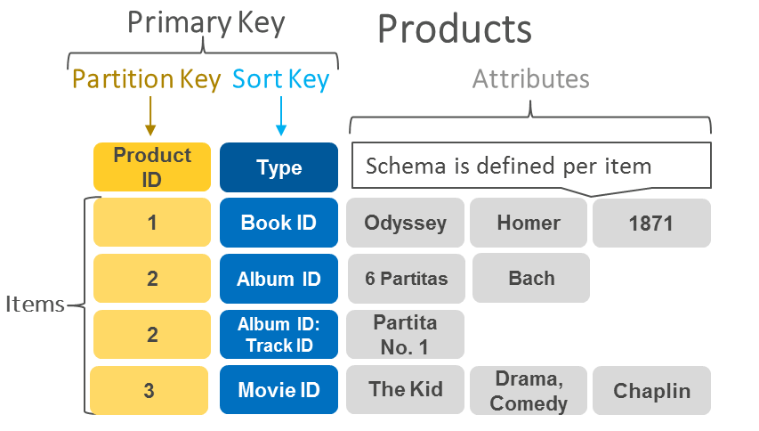

Certainly! Here are the complete steps to generate an SSH key, add it to your GitHub account, and test the connection. 

### Navigate to SSH
``` cd .ssh```

### **Generate SSH Key**

Open your terminal and run the following command to generate a new SSH key:

```bash
ssh-keygen -t rsa -b 4096 -C "your_email@gmail.com"
```

press `Enter` to save. the key to the default location (`~/.ssh/id_rsa`), and optionally enter a passphrase.


### get keys


### Start the SSH agent in the background
eval \`ssh-agent`\
ssh-add ~/.ssh/git_test_key


### **Add SSH Key to GitHub**

1. Go to [GitHub SSH and GPG keys settings](https://github.com/settings/keys).
2. Click on the "New SSH key" button.
3. In the "Title" field, add a descriptive label for the new key.
4. Paste your SSH key into the "Key" field.
5. Click "Add SSH key".

###  **Test SSH Connection to GitHub**

Run the following command to test the SSH connection:

```bash
ssh -T git@github.com
```

You should see a message like this:

```
Hi username! You've successfully authenticated, but GitHub does not provide shell access.
```

This confirms that your SSH key is working correctly with GitHub.

### 6. **Clone Repository Using SSH**

Now you can clone repositories using the SSH URL:

```bash
git clone git@github.com:username/repository.git
```

### adding readme.md
`nano README.md`

To push your changes to a remote Git repository after editing the README.md file, follow these steps:

Save and Exit nano:

If you haven't already done so, save the changes in nano by pressing Ctrl + O, then press Enter to confirm. Exit nano by pressing Ctrl + X.
